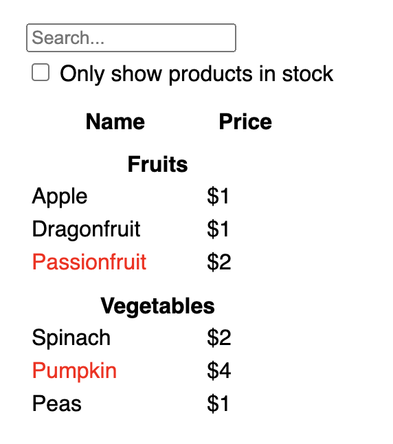
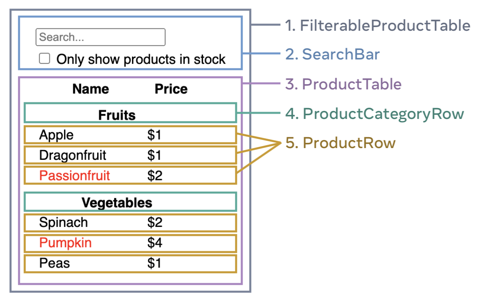

# Thinking in React

리액트는 앱에서 디자인을 바라보는 사고 방식을 바꿔줍니다. 리액트의 UI를 구성할 때, 이를 `components` 조각으로 분해합니다. 그러고나서 각각의 컴포넌트에 필요한 화면에 보이는 상태값을 만들어 냅니다. 최종적으로, 컴포넌트끼리 연결하여 data가 컴포넌트를 통해 흐를 수 있습니다. 이 튜토리얼에선, 리액트를 사용하여 검색 가능한 상품 데이터를 만드는 과정을 설명할 것입니다.

## Start with the mockup

아래 응답값을 반환하는 JSON API와 디자인 mockup을 받았습니다.

```js
[
  { category: "Fruits", price: "$1", stocked: true, name: "Apple" },
  { category: "Fruits", price: "$1", stocked: true, name: "Dragonfruit" },
  { category: "Fruits", price: "$2", stocked: false, name: "Passionfruit" },
  { category: "Vegetables", price: "$2", stocked: true, name: "Spinach" },
  { category: "Vegetables", price: "$4", stocked: false, name: "Pumpkin" },
  { category: "Vegetables", price: "$1", stocked: true, name: "Peas" }
]
```



## Step 1: Break the UI into a component hierarchy 

다양한 방법으로 디자인 시안을 컴포넌트로 분리할 수 있습니다.

- Programming: 컴포넌트는 이상적으로 한가지 일을 해야한다는 [단일 책임 원칙](https://en.wikipedia.org/wiki/Single-responsibility_principle)을 사용합니다. 컴포넌트가 커질 수록 더 작은 서브 컴포넌트로 분해되어야 합니다.
- CSS: 클래스 선택자로 무엇을 지정할지 고려합니다.
- 디자인의 레이어를 어떻게 체계적으로 정리할지 고려합니다.

JSON이 잘 구성되었다면, UI의 컴포넌트 구조와 잘 매핑됩니다.



1. `FilterableProductTable`은 전체 앱을 포함합니다.
2. `SearchBar`는 사용자의 입력을 받습니다.
3. `ProductTable`은 사용자 입력에 따라 리스트를 필터하고 보여줍니다.
4. `ProductCategoryRow`는 각 카테고리를 보여줍니다.
5. `ProductRow`는 상품을 보여줍니다.


선호에 따라 `ProductTable`에 Name 또는 Pirce 헤더를 포함할지를 결정하면 됩니다. 만약 app이 커져 sort 기능까지 추가된다면 `ProductTableHeader`컴포넌트로 나누는 것도 고려해볼 수 있습니다.

이제 컴포넌트들은 다음과 같은 계층 구조를 가지게 됩니다.

- FilterableProductTable
  - SearchBar
  - ProductTable
    - ProductCategoryRow
    - ProductRow


## Step 2: Build a static version in React 

가장 간단명료한 접근은 인터랙션 기능 없이 data 모델로부터 UI를 보여주는 것 부터 시작합시다. 보통 static UI를 짜고 나중에 인터랙션 기능을 구현합니다.

앱의 static 버전을 구성하기 위해서 다른 컴포넌트를 재사용하는 컴포넌트를 구성하고 data를 props 방식으로 전달할 것입니다.

UI가 간단한 경우 "top down" 방식이 쉽고 큰 프로젝트에선 "bottom-up" 방식으로 컴포넌트를 구성하는게 적절합니다.

```jsx
function ProductCategoryRow({ category }) {
  return (
    <tr>
      <th colSpan="2">
        {category}
      </th>
    </tr>
  );
}

function ProductRow({ product }) {
  const name = product.stocked ? product.name :
    <span style={{ color: 'red' }}>
      {product.name}
    </span>;

  return (
    <tr>
      <td>{name}</td>
      <td>{product.price}</td>
    </tr>
  );
}

function ProductTable({ products }) {
  const rows = [];
  let lastCategory = null;

  products.forEach((product) => {
    if (product.category !== lastCategory) {
      rows.push(
        <ProductCategoryRow
          category={product.category}
          key={product.category} />
      );
    }
    rows.push(
      <ProductRow
        product={product}
        key={product.name} />
    );
    lastCategory = product.category;
  });

  return (
    <table>
      <thead>
        <tr>
          <th>Name</th>
          <th>Price</th>
        </tr>
      </thead>
      <tbody>{rows}</tbody>
    </table>
  );
}

function SearchBar() {
  return (
    <form>
      <input type="text" placeholder="Search..." />
      <label>
        <input type="checkbox" />
        {' '}
        Only show products in stock
      </label>
    </form>
  );
}

function FilterableProductTable({ products }) {
  return (
    <div>
      <SearchBar />
      <ProductTable products={products} />
    </div>
  );
}

const PRODUCTS = [
  {category: "Fruits", price: "$1", stocked: true, name: "Apple"},
  {category: "Fruits", price: "$1", stocked: true, name: "Dragonfruit"},
  {category: "Fruits", price: "$2", stocked: false, name: "Passionfruit"},
  {category: "Vegetables", price: "$2", stocked: true, name: "Spinach"},
  {category: "Vegetables", price: "$4", stocked: false, name: "Pumpkin"},
  {category: "Vegetables", price: "$1", stocked: true, name: "Peas"}
];

export default function App() {
  return <FilterableProductTable products={PRODUCTS} />;
}

```

## Step 3: Find the minimal but complete representation of UI state 

UI를 인터랙티브하게 만들기 위해선 사용자가 data를 변경할 수 있도록 만들어야 합니다. 이를 위해 `state`를 사용합니다.

state를 앱이 기억할 필요가 있는 데이터를 변경하는 가장 최소한의 set이라고 생각해봅시다. state를 구조화하는 가장 중요한 원칙은 [DRY (Don't Repeat Yourself)](https://en.wikipedia.org/wiki/Don%27t_repeat_yourself) 입니다. *state가 최소한으로 표현*되어야 한다는 점을 이해하고, 필요에 따라 **기타 모든 것**들을 계산해야 합니다.

예를 들어, *상품 배열을 state*로 저장해야 합니다. 만약 **상품의 개수**를 표현하고 싶다면, **상품 개수**를 따로 state를 만들어 관리하는 것 대신에 배열의 길이를 읽어야 합니다.

위 예제의 필요한 데이터들입니다.

1. 원본 상품 리스트
2. 유저가 입력한 텍스트
3. 체크 여부
4. 필터된 상품 리스트

이들 중 어떤 것을 state로 관리해야 할까요? 먼저 state로 관리하지 않아도 되는 것을 판단해 봅시다.

- 시간이 지나도 변하지 않다면, state가 아닙니다.
- 부모 컴포넌트로부터 props가 전달된다면, state가 아닙니다.
- state 또는 props로 부터 충분히 계산할 수 있는 값이라면, *확실하게* state가 아닙니다.

이 외의 data를 state로 관리하면 됩니다.

1. 상품 배열은 props로 전달되므로 state가 아닙니다.
2. 유저가 입력한 텍스트는 변경 가능하고 다른 state 또는 props로부터 계산될 수 없으므로 state입니다.
3. 체크 여부역시 state입니다.
4. 필터된 상품 리스트는 원본 리스트로, 유저가 입력한 텍스트, 그리고 체크 여부로부터 충분히 계산될 수 있는 값이므로 state가 아닙니다.

<details>
<summary>Props vs State</summary>
<div markdown="1">

- Props는 함수에 전달하는 인자와 유사합니다. props는 부모 컴포넌트가 자식 컴포넌트에게 데이터를 전달할 수 있게 합니다.
- State는 컴포넌트의 메모리와 유사합니다. state로 컴포넌트가 어떠한 정보 값을 계속 유지할 수 있고 인터랙션에 반응하여 바뀔 수 있습니다.

Props와 State는 다르지만 함께 동작합니다. 종종 부모 컴포넌트가 state의 정보를 유지하고 자식 컴포넌트에게 props로 전달합니다.

</div>
</details>


## Step 4: Identify where your state should live 

어떤 컴포넌트가 state를 소유할지 바로 결정하기란 어렵습니다. 다음 스텝을 따르는게 도움이 될 것입니다.

1. 특정 state에 기반하여 무언갈 렌더링하는 모든 컴포넌트를 식별합니다.
2. 그들에게 가장 인접한 공통 부모 컴포넌트를 찾습니다.
3. state를 어디에 둘지 결정합니다.
   1. 공통 부모 컴포넌트
   2. 공통 부모 컴포넌트 위의 컴포넌트
   3. state를 유지하기 위한 새 컴포넌트를 만들고 부모 컴포넌트 위 어딘가에 추가합니다.

위 예제에선 사용자 입력 텍스트와 체크 여부가 같이 나타나므로, 그들을 같은 곳에 두는 것이 타당합니다.

1. 특정 state에 기반하여 무언갈 렌더링하는 모든 컴포넌트를 식별합니다.
   - `ProductTable`은 두 가지 state에 기반하여 상품 목록을 필터해야 합니다.
   - `SearchBar`는 두 가지 상태를 보여줘야 합니다.
2. 그들에게 가장 인접한 공통 부모 컴포넌트를 찾습니다.
   - 두 컴포넌트를 포함하는 가장 인접한 부모 컴포넌트는 `FilterableProductTable`입니다.
3. state를 어디에 둘지 결정합니다.
    - `FilterableProductTable`에 둡니다.


```jsx
function FilterableProductTable({ products }) {
  const [filterText, setFilterText] = useState('');
  const [inStockOnly, setInStockOnly] = useState(false);

// ...
    <div>
      <SearchBar 
        filterText={filterText} 
        inStockOnly={inStockOnly} />
      <ProductTable 
        products={products}
        filterText={filterText}
        inStockOnly={inStockOnly} />
    </div>
// ...
}
```

## Step 5: Add inverse data flow 

인터랙션을 위해선 계층 구조 깊숙히 있는 컴포넌트에서 `FilterableProductTable`의 state를 업데이트 해야합니다.

방법은 `setState`함수도 props로 전달해주는 것입니다.

```jsx
function FilterableProductTable({ products }) {
  const [filterText, setFilterText] = useState('');
  const [inStockOnly, setInStockOnly] = useState(false);

  return (
    <div>
      <SearchBar 
        filterText={filterText} 
        inStockOnly={inStockOnly}
        onFilterTextChange={setFilterText}
        onInStockOnlyChange={setInStockOnly} />
```

```jsx
<input 
  type="text" 
  value={filterText} 
  placeholder="Search..." 
  onChange={(e) => onFilterTextChange(e.target.value)}
/>
```

참고: [Adding Interactivity](https://react.dev/learn/adding-interactivity)

