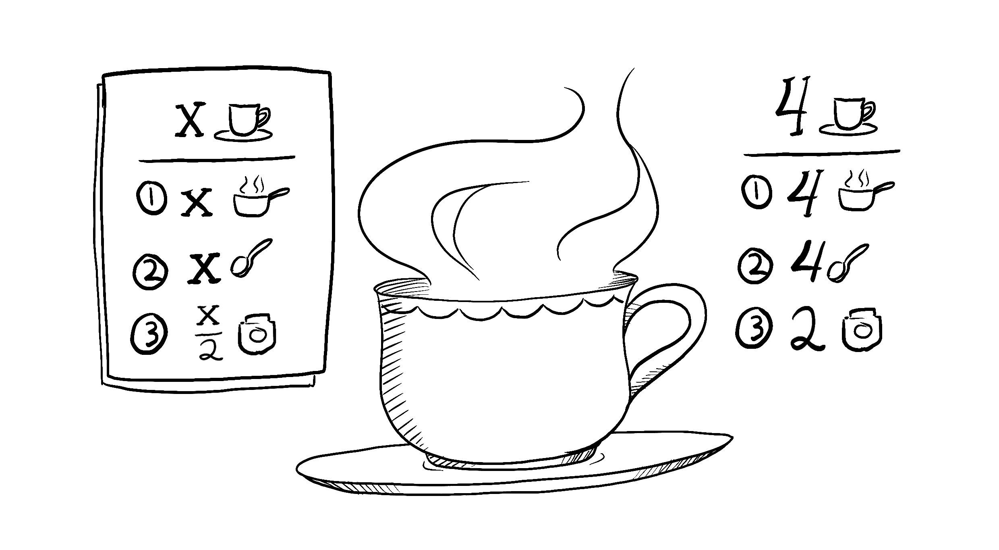

# Keeping Component Pure

순수함수는 오직 계산만 수행합니다. 컴포넌트를 순수 함수로 만듦으로써, 코드베이스가 증가함에 따라 이해할 수 없는 버그나 예측할 수 없는 동작을 피할 수 있습니다. 그러나, 이러한 이점을 얻기 위해선 몇 가지 규칙을 따라야 합니다.

## You will learn
- 순수한 것은 무엇이며 어떻게 버그를 피하게 해주는가?
- 렌더링 단계에서 변경 사항을 방지하여 컴포넌트를 순수하게 유지하는 방법
- Strict Mode를 사용하여 컴포넌트 실수를 줄이는 법

## Purity: Components as formulas 

컴퓨터 공학 특히 함수형 프로그래밍에서 [순수 함수](https://en.wikipedia.org/wiki/Pure_function)는 다음 특징을 가집니다.

- **It minds its own business.** 호출되기 전에 기존의 어떠한 객체나 변수를 변경하지 않습니다. 
- **Same inputs, same output.** 같은 인풋에 대해서 항상 같은 아웃풋을 반환합니다. 순수 함수는 마치 수학의 공식과 같습니다.

y = 2x. 함수가 있습니다.

x = 2 라면 항상 y = 4 입니다.
x = 3 이라면 항상 y = 6 입니다.

만약 x = 3 이라면 y는 시간이나 주식 상태에 의존하여 9나 -1 또는 2.5가 될 수 없습니다.

이것을 자바스크립트 함수로 바꾸면 다음과 같습니다.

```js
function double(number) {
  return 2 * number;
}
```

위 예제에서 `double`은 **순수 함수** 입니다.

리액트는 이 개념을 중심으로 설계되었습니다. 리액트는 당신이 작성한 모든 컴포넌트가 순수 함수라고 가정합니다. 이는 컴포넌트가 같은 인풋에 대해 항상 같은 JSX를 반환해야 한다는 것을 의미합니다.

```jsx
function Recipe({ drinkers }) {
  return (
    <ol>    
      <li>Boil {drinkers} cups of water.</li>
      <li>Add {drinkers} spoons of tea and {0.5 * drinkers} spoons of spice.</li>
      <li>Add {0.5 * drinkers} cups of milk to boil and sugar to taste.</li>
    </ol>
  );
}

export default function App() {
  return (
    <section>
      <h1>Spiced Chai Recipe</h1>
      <h2>For two</h2>
      <Recipe drinkers={2} />
      <h2>For a gathering</h2>
      <Recipe drinkers={4} />
    </section>
  );
}
```

`Recipe`에 `drinkers={2}`를 전달하면 항상 `2 cups of water`를 포함한 JSX를 반환합니다.
`Recipe`에 `drinkers={4}`를 전달하면 항상 `4 cups of water`를 포함한 JSX를 반환합니다.

마치 수학 공식 같죠.

컴포넌트를 레서피로 생각해야 합니다. 이를 따르고 매번 같은 재료로 요리한다면 항상 같은 음식을 만들게 됩니다. 이 "음식"은 컴포넌트가 리액트에게 [렌더링](https://react.dev/learn/render-and-commit)하라고 전해준 JSX와 동일합니다.




## Side Effects: (un)intended consequences 

리액트 렌더링 과정은 항상 순수해야 합니다. 컴포넌트는 오직 자신의 JSX만 반환해야 하고, 렌더링 전에 존재하는 어느 객체나 변수라도 변경하면 이는 순수성을 잃게 만듭니다.

아래는 이 규칙을 지키지 않은 예시입니다.

```jsx
let guest = 0;

function Cup() {
  // Bad: changing a preexisting variable!
  guest = guest + 1;
  return <h2>Tea cup for guest #{guest}</h2>;
}

export default function TeaSet() {
  return (
    <>
      <Cup />
      <Cup />
      <Cup />
    </>
  );
}
```

이 컴포넌트는 외부에 선언된 `guest` 변수를 읽고 씁니다. 이것은 **컴포넌트를 여러번 호출하면 다른 JSX를 생성**한다는 것을 의미합니다! 게다가 만약 다른 컴포넌트가 `guest`를 읽는다면, 그 역시 언제 렌더링되느냐에 따라 다른 JSX를 생성하게 됩니다. 이것은 예측 불가능합니다.

y = 2x 공식으로 돌아가서 이제 x가 2일지라도, y가 4라는 것을 믿을 수 없습니다. 테스트는 실패하고 사용자들은 당황하고 비행기는 하늘에서 떨어질 것입니다. 

대신 `guest`를 prop으로 전달함으로써 이 컴포넌트를 고칠 수 있습니다.

```jsx
function Cup({ guest }) {
  return <h2>Tea cup for guest #{guest}</h2>;
}

export default function TeaSet() {
  return (
    <>
      <Cup guest={1} />
      <Cup guest={2} />
      <Cup guest={3} />
    </>
  );
}
```

이제 `guest` prop에만 의존하여 JSX를 반환하는 순수 컴포넌트가 되었습니다.

일반적으로, 컴포넌트가 특정한 순서대로 렌더링되는 것을 기대하면 안됩니다. y = 2x를 y = 5x 이전 혹은 이전에 호출하는지는 중요하지 않습니다. 두 공식은 서로 독립적으로 결정됩니다.

같은 방식으로 각각의 컴포넌트는 오직 "think for itself" 해야 하고, 렌더링 중에 다른 구성 요소와 조정하거나 의존하려는 시도를 하지 않아야 합니다. 렌더링은 학교 시험과 비슷합니다. 각 컴포넌트는 각자 스스로 JSX를 계산해야 합니다.

### Deep Dive - Detecting impure calculations with StrictMode 

아직 사용하진 않았지만, 리액트에는 렌더링 동안에 읽을 수 있는 세 종류의 인풋이 있습니다. props와 state 그리고 context인데 항상 이 세가지를 읽기 전용으로 다뤄야 합니다.

사용자의 입력에 따라 무언가를 바꾸고 싶다면, 변수에 직접 쓰는 것 대신 [set state](https://react.dev/learn/state-a-components-memory)를 사용해야 합니다. 컴포넌트가 렌더링되는 동안에는 절대 전에 존재하던 변수나 객체 값을 수정해선 안됩니다.

리액트는 개발 모드에서 각각의 컴포넌트 함수를 두번 호출하는 "Strict Mode"를 제공합니다. **컴포넌트를 두번 호출함으로써 컴포넌트가 이러한 규칙을 위반하는지 파악할 수 있습니다.**

어떻게 전의 예제가 “Guest #1”, “Guest #2”, 그리고 “Guest #3” 대신에 “Guest #2”, “Guest #4”, “Guest #6”를 보여주는지 주목하세요. 기존 함수는 순수하지 않아서 두번 호출하는 것은 규칙을 위반합니다. 그러나 수정된 순수 함수 버전은 매번 함수가 두번 호출되더라도 정상적으로 작동합니다. **순수 함수는 오직 계산만 하기 때문에 이것을 두번 호출하는 것은 어떠한 것도 변경하지 않습니다.** 마치 `double(2)`을 두번 호출한다고 해서 y값이 변하지 않는 것처럼 말이죠. 같은 입력을 주면 항상 같은 결과값을 반환해야 합니다.

Strict Mode는 프로덕션 모드에선 동작하지 않으므로 app을 느리게 만들지 않습니다. Stict Mode를 사용하기 위해선 root 컴포넌트를 `<React.StrictMode>`로 감싸면 됩니다. 

### Local mutation: Your component’s little secret 

위 예제에서 컴포넌트가 렌더링 동안 기존 변수를 바꾸고 있는게 문제였습니다. 이는 종종 **"mutation"**이라 불립니다. 순수 함수는 이것이 호출되기 전에 함수 외부 스코프에 선언된 변수나 객체를 mutate하지 않습니다. 만약 그렇다면 비순수 함수가 됩니다.

그러나, **렌더링 동안에 생성한 변수나 객체를 바꾸는 것은 괜찮습니다.** 이 예제에서 `[]` 배열을 만들고 `cups` 변수에 할당한 뒤 12개의 컵을 넣습니다.

```js
function Cup({ guest }) {
  return <h2>Tea cup for guest #{guest}</h2>;
}

export default function TeaGathering() {
  let cups = [];
  for (let i = 1; i <= 12; i++) {
    cups.push(<Cup key={i} guest={i} />);
  }
  return cups;
}
```

만약 `cups` 변수 또는 `[]` 배열이 `TeaGathering`함수 외부에서 생성됐다면 이것은 큰 문제입니다. 항목들을 해당 배열에 넣어서 기존 객체를 변경하게 됩니다.

그러나, `TeaGathering` 내부에서 *동일한 렌더링 중*에 생성되었기 때문에 괜찮습니다. 이런 일이 일어났다는 것을 `TeaGathering` 외부의 어떤 코드도 알 수 없을 것입니다. 이것을 **"local mutation"**이라 부릅니다. 컴포넌트의 작은 비밀같습니다.

## Where you can cause side effects 

함수형 프로그래밍은 순수성에 크게 의존하지만, 어느 순간, 어딘가에서 무언가 바뀌어야 합니다. **리액트에선 side effect는 주로 [이벤트 핸들러](https://react.dev/learn/responding-to-events) 내부에 있습니다.** 이벤트 핸들러는 어떠한 액션을 수행할 때 리액트가 실행하는 함수입니다. 버튼 클릭이 한 예시입니다. 이벤트 핸들러가 컴포넌트 안에 정의되었지만, *렌더링 동안에 실행되지 않습니다*! 그래서 이벤트 핸들러는 순수하지 않아도 됩니다.

다른 모든 옵션을 모두 사용했지만 side effect에 적합한 이벤트 핸들러를 찾을 수 없는 경우 컴포넌트 안에 [useEffect](https://react.dev/reference/react/useEffect) 호출을 사용하여 반환된 JSX에 연결할 수 있습니다. 이것은 side effect가 허용될 때, 리액트에게 렌더링 후 나중에 실행하라는 것입니다. 그러나, 이 접근 방식은 최후의 수단이 되어야 합니다.

가능하면 렌더링만으로 로직을 표현하십시오. 이것이 얼마나 멀리 데려다줄 수 있는지 놀라게 될 것입니다!

```js
import React, { useState, useEffect } from 'react';

function ItemList() {
  const [items, setItems] = useState([]);

  const fetchData = async () => {
    // Simulating a fetch request to a server
    const response = await fetch('https://api.example.com/items');
    const data = await response.json();
    setItems(data);
  };

  useEffect(() => {
    // This effect will run after the component renders
    fetchData();
  }, []); // Empty dependency array means this effect only runs after the initial render

  return (
    <div>
      <ul>
        {items.map((item, index) => (
          <li key={index}>{item.name}</li>
        ))}
      </ul>
      <button onClick={fetchData}>Fetch More Items</button>
    </div>
  );
}

export default ItemList;
```

there are certain operations that are not directly related to rendering but are necessary for your application to function properly, such as fetching data from a server, updating a global state, or interacting with the browser's APIs.

These operations are referred to as **"side effects."** In the context of React, side effects include tasks that don't directly impact the rendering of the component but are important for the overall functionality of the application.

### Deep Dive - Why does React care about purity?

순수한 함수를 작성하는 것은 습관과 훈련이 필요합니다. 하지만 그것은 또한 놀라운 기회를 열어줍니다.

- 컴포넌트는 다양한 환경에서 실행될 수 있습니다. 예를 들어 서버가 있습니다. 같은 인풋에 대해 항상 같은 결과만을 반환함으로 하나의 컴포넌트로 많은 사용자 요청을 처리할 수 있습니다.
- 인풋이 바뀌지 않는 컴포넌트를 [렌더링하지 않고 건너뜀](https://react.dev/reference/react/memo)으로써 성능을 향상시킬 수 있습니다. 순수 함수는 항상 같은 결과를 반환하기 때문에 캐싱에 있어서 안전합니다.
- 심층 컴포넌트 트리를 렌더링하는 도중 일부 데이터가 변경되면 React는 오래된 렌더링을 완료하는 데 시간을 낭비하지 않고 렌더링을 다시 시작할 수 있습니다. 순수성을 통해 언제든지 계산을 중단할 수 있습니다.

우리가 만들고 있는 모든 새로운 리액트 기능은 순수성을 이용합니다. data 가져오기부터 애니메이션, 성능에 이르기까지 컴포넌트를 순수하게 유지하는 것은 리액트 패러다임의 힘을 발휘합니다.


## Fix a broken story tray

You’ve written a StoryTray component that accepts a list of stories, followed by a “Create Story” placeholder.

You implemented the “Create Story” placeholder by pushing one more fake story at the end of the stories array that you receive as a prop. But for some reason, “Create Story” appears more than once. Fix the issue.


```jsx
export default function StoryTray({ stories }) {
  stories.push({
    id: 'create',
    label: 'Create Story'
  });

  return (
    <ul>
      {stories.map(story => (
        <li key={story.id}>
          {story.label}
        </li>
      ))}
    </ul>
  );
}
```

### Solution

시계가 업데이트될 때마다 "Create Story"가 두번 추가되는 것을 확인하십시오. 이는 렌더링 중에 mutation이 발생했음을 암시합니다. Strict Mode는 이러한 문제를 더 눈에 띄게 만들기 위해 컴포넌트를 두 번 호출합니다.

`StoryTray`는 순수 함수가 아닙니다. prop으로 받은 `stories` 배열에 `push`를 사용함으로써, `StoryTray`가 렌더링을 시작하기 전에 생성된 객체를 mutate합니다. 이것은 버그를 발생하고 예측하기 어렵게 만듭니다. 

간단한 방법은 배열을 건드리지 않고 "Create Story"를 개별적으로 렌더링하는 것입니다.

```jsx
export default function StoryTray({ stories }) {
  return (
    <ul>
      {stories.map(story => (
        <li key={story.id}>
          {story.label}
        </li>
      ))}
      <li>Create Story</li>
    </ul>
  );
}
```

다른 방법으로, 요소를 배열 안에 넣기 전에 기존의 것을 복사한 새로운 배열을 만들 수 있습니다.

```jsx
export default function StoryTray({ stories }) {
  // Copy the array!
  let storiesToDisplay = stories.slice();

  // Does not affect the original array:
  storiesToDisplay.push({
    id: 'create',
    label: 'Create Story'
  });

  return (
    <ul>
      {storiesToDisplay.map(story => (
        <li key={story.id}>
          {story.label}
        </li>
      ))}
    </ul>
  );
}

```

이것은 mutation이 지역적으로 일어나게 만들어서 렌더링 함수를 순수하게 만듭니다. 그러나, 여전히 조심해야 하는게 예를 들어, 배열의 기존 항목을 변경하려고 하면 해당 항목들도 복제해야 합니다.

어떤 메서드가 배열을 mutate하는지 안하는지 기억하는 것은 유용합니다. 예를 들어, `push`, `pop`, `reverse`, 그리고 `sort`는 기존 배열을 mutate합니다. 그러나 `slice`, `filter`, 그리고 `map`은 새로운 배열 또는 객체를 생성합니다.
