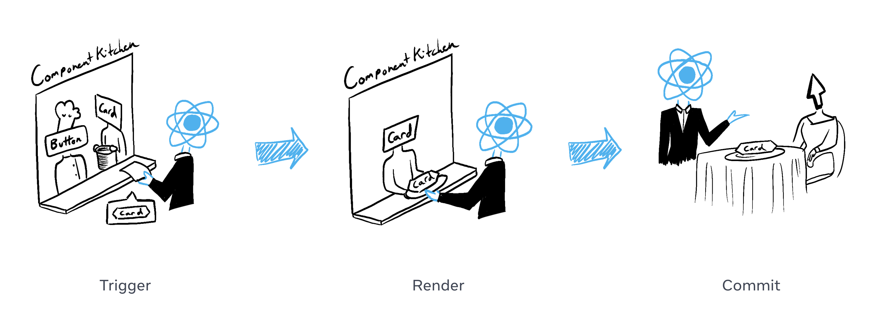
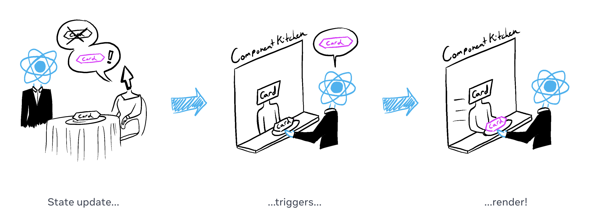

# Render and Commit

컴포넌트가 화면에 표시되기전에 React는 컴포넌트를 렌더링해야 합니다. 이 과정을 이해함으로써 코드가 어떻게 실행되는지 사고하거나 이 동작을 설명하는데 도움을 줄 수 있습니다.

## You will learn
- 리액트에서 렌더링이란?
- 언제, 왜 리액트가 컴포넌트를 렌더링하는가?
- 컴포넌트를 화면에 표시하는 단계
- 렌더링이 항상 DOM 업데이트를 발생시키지 않는 이유

컴포넌트가 주방에서 여러 재료들로 맛있는 음식을 요리하는 중이라 상상해봅시다. 이 시나리오에서 리액트는 고객들로부터 요청을 받고 고객들이 주문한 메뉴를 가져다주는 웨이터 입니다. 요청을 받고 UI를 제공하는 과정은 3단계로 이뤄져 있습니다.

1. Triggering a render (고객의 주문을 주방에 전달)
2. Rendering the component (주방에서 주문 메뉴를 준비)
3. Committing to the DOM (메뉴를 테이블 위에 세팅)



## Step 1: Trigger a render 
컴포넌트가 렌더되는 두가지 경우가 있습니다.

1. 컴포넌트가 초기 렌더링 될 때
2. 컴포넌트 또는 조상 컴포넌트의 state가 업데이트 될 때

### Initial render 
앱이 시작될 때 초기 렌더링을 트리거해야 합니다. 프레임워크들과 샌드박스들은 가끔 이 코드를 숨기지만 이 과정은 타겟 DOM 노드와 함께 `createRoot`를 호출함으로써 수행되고 나서 `render` 메서드를 컴포넌트와 함께 호출합니다.

```jsx
import Image from './Image.js';
import { createRoot } from 'react-dom/client';

const root = createRoot(document.getElementById('root'))
root.render(<Image />);
```

`root.render(<Image />);`를 주석처리 하면 컴포넌트가 사라집니다!

### Re-renders when state updates 

컴포넌트가 초기 렌더링되기만 하면, `setState` 함수로 state를 업데이트함으로써 추가적으로 렌더링을 트리거할 수 있습니다. 컴포넌트의 state를 업데이트하면 렌더링이 자동적으로 큐 대기열에 들어갑니다. (고객이 처음 메뉴를 주문한 뒤로 갈증이나 배고픔에 따라 차, 디저트 등을 주문하는 것을 상상해봅시다.)



## Step 2: React renders your components 

렌더링을 트리거한 후에 리액트는 화면에 무엇을 표시할지 결정하기 위해서 컴포넌트를 호출합니다. "Rendering"은 React가 컴포넌트를 호출하는 것입니다. 

- **초기 렌더링**에서 리액트는 root 컴포넌트를 호출합니다.
- **후속 렌더링**의 경우 리액트는 상태 업데이트가 렌더링을 트리거하는 컴포넌트 함수를 호출할 것입니다.

이 과정은 재귀적으로 수행됩니다. 만약 업데이트된 컴포넌트가 또 다른 컴포넌트를 반환한다면, 리액트는 다음으로 이 컴포넌트를 렌더링할 것이고 만약 이 컴포넌트 역시 또 다른 컴포넌트를 반환한다면 그 컴포넌트도 렌더링될 것입니다. 이 과정은 중첩된 컴포넌트가 더이상 없을 때까지 계속될 것이며 리액트는 화면에 무엇을 표시해야 되는지 정확히 알게 됩니다.

아래 예제에서 리액트는 `<Gallery />`를 호출하고 `<image />`는 여러번 호출합니다.
```jsx
import Gallery from './Gallery.js';
import { createRoot } from 'react-dom/client';

const root = createRoot(document.getElementById('root'))
root.render(<Gallery />);
```

```jsx
export default function Gallery() {
  return (
    <section>
      <h1>Inspiring Sculptures</h1>
      <Image />
      <Image />
      <Image />
    </section>
  );
}

function Image() {
  return (
    
  );
}
```

- **초기 렌더링** 동안, 리액트는 `<section>`, `<h1>`, 그리고 세개의 `` 태그들을 위한 [DOM 노드를 생성](https://developer.mozilla.org/en-US/docs/Web/API/Document/createElement)합니다.
- **리렌더링** 동안, 리액트는 그들의 속성들이 이전 렌더링 이후로 바뀐게 있는지 계산합니다. 다음 단계인 커밋 페이지 까지는 이 정보로 아무것도 수행하지 않습니다.

### Pitfall!

렌더링은 반드시 [순수하게 계산](https://react.dev/learn/keeping-components-pure)되어야 합니다.

- **Same inputs, same output.** 같은 인풋이 주어진다면 컴포넌트는 항상 같은 JSX를 반환합니다. (누군가 토마토 샐러드를 했는데 그들이 양파 샐러드를 받아선 안됩니다.)
- **It minds its own business.** 렌더링 이전의 기존 객체 또는 변수들을 변경해선 안됩니다. (한 주문이 누군가의 주문을 변경할 순 없습니다.)

다르게 말해서, 코드 복잡도가 늘어날수록 예측 불가능한 동작과 혼란스러운 버그들을 마주칠 수 있습니다. "Strict Mode"에서 개발할 때, 리액트는 컴포넌트를 두번 호출하여 순수하지 않은 함수에 의해서 발생하는 실수를 확인하는데 도움을 줍니다.

### Deep Dive - Optimizing performance 

state가 업데이트된 컴포넌트가 DOM 트리 중 매우 높이 있다면, 하위 컴포넌트들이 모두 렌더링 되는 것은 성능상 좋지 않습니다. 성능 문제가 발생할 경우 [Performance](https://legacy.reactjs.org/docs/optimizing-performance.html) 섹션에 설명된 해결 방법이 몇 가지 있습니다. **그러나 섣불리 최적화하진 마십쇼!**

## Step 3: React commits changes to the DOM

컴포넌트를 렌더링한 뒤 리액트는 DOM을 수정합니다.

- **초기 렌더링**에서 리액트는 [appendChild()](https://developer.mozilla.org/en-US/docs/Web/API/Node/appendChild) DOM API를 사용하여 생성한 모든 DOM node들을 화면에 반영합니다.
- **리렌더링**시 리액트는 필요한 최소한의 연산(렌더링 중 계산!)을 적용하여 DOM이 최신 렌더링 결과물과 일치하도록 합니다.

리액트는 오직 두 렌더 결과물 사이에 차이가 있을 때에만 DOM 노드를 변경합니다. 예를 들어, 부모로부터 매 초마다 달라지는 props를 전달받는 컴포넌트가 있습니다. `<input>`에 텍스트를 입력하여 값을 변경하지만, 컴포넌트가 리렌더링 될 때 입력값이 사라지지 않는다는 점을 주목하세요.

```js
export default function Clock({ time }) {
  return (
    <>
      <h1>{time}</h1>
      <input />
    </>
  );
}
```

마지막 Commit 단계에서 리액트는 오직 <h1> 태그의 새로운 값만 업데이트 하기 때문입니다. <input>이 JSX에서 이전과 같은 위치에 표시되므로 React는 <input> 또는 그 값을 건드리지 않습니다!

## Epilogue: Browser paint 
렌더링이 끝난 후 리액트는 DOM을 수정하고 브라우저는 화면을 repaint합니다. 이 과정이 "브라우저 렌더링"으로 알려져 있지만, 본 docs에선 혼란을 피하기 위해 "페인팅"이라고 부르겠습니다.

## Recap
- 리액트 앱의 화면 업데이트 과정은 다음 세 단계로 이뤄집니다.
  1. Trigger
  2. Render
  3. Commit

- 컴포넌트에서 실수를 찾기위해 Strict Mode를 사용해야 합니다.
- 렌더링 결과물이 최근 것과 같다면 리액트는 DOM을 건들지 않습니다.