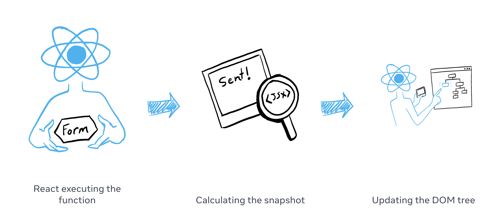
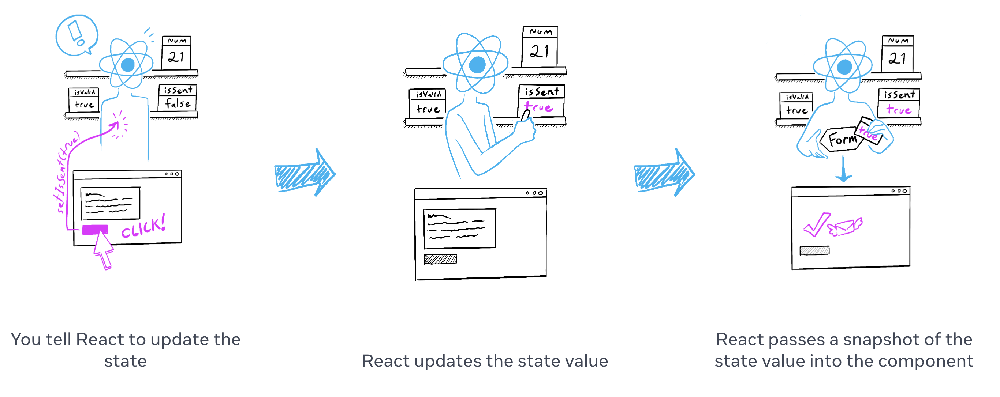

# State as a Snapshot

state는 읽고 쓸 수 있는 일반적인 자바스크립트 변수처럼 보입니다. 하지만, state는 snapshot처럼 동작합니다. `setState`는 state를 바꾸는 것이 아니라 리렌더링을 유발합니다. 

## You will learn
- 어떻게 `setState`가 리렌더링을 하는지
- 언제, 어떻게 state가 업데이트되는지
- 왜 state가 즉시 업데이트되지 않는지
- 어떻게 이벤트 핸들러가 state의 "snapshot"에 접근하는지

## Setting state triggers renders

사용자 인터페이스는 클릭과 같이 사용자 이벤트에 직접 응답하여 변경되는 것으로 생각할 수 있습니다. 리액트는 이러한 mental model과는 약간 다르게 동작합니다. 이전 챕터에서 [setting state가 리액트에게 리렌더링을 요청](https://react.dev/learn/render-and-commit#step-1-trigger-a-render)하는 것을 봤습니다. 즉, 인터페이스가 이벤트에 반응하려면 상태를 *업데이트*해야 합니다. 

아래 예제에서 "send"를 누르면 `setIsSent(true)`가 리액트에게 UI 리렌더링을 요청합니다.

```jsx
import { useState } from 'react';

export default function Form() {
  const [isSent, setIsSent] = useState(false);
  const [message, setMessage] = useState('Hi!');
  if (isSent) {
    return <h1>Your message is on its way!</h1>
  }
  return (
    <form onSubmit={(e) => {
      e.preventDefault();
      setIsSent(true);
      sendMessage(message);
    }}>
      <textarea
        placeholder="Message"
        value={message}
        onChange={e => setMessage(e.target.value)}
      />
      <button type="submit">Send</button>
    </form>
  );
}

function sendMessage(message) {
  // ...
}
```

버튼을 클릭했을 때 일어나는 과정입니다.

1. `onSubmit` 이벤트 핸들러가 실행됩니다.
2. `setIsSent(true)`는 `isSent`를 `true`로 세팅하고 새로운 렌더링을 queue에 넣습니다.
3. 리액트는 새로운 `isSent`에 따라 컴포넌트를 리렌더링합니다.

state와 렌더링의 관계에 대해 더 자세히 알아봅시다.

## Rendering takes a snapshot in time 

[렌더링](https://react.dev/learn/render-and-commit#step-2-react-renders-your-components)은 리액트가 컴포넌트를 호출하는 것입니다. 함수가 반환한 JSX는 UI의 snapshot같습니다. 그것의 props, 이벤트 핸들러와 지역 변수들은 **렌더링 될 때의 state**를 사용하여 계산됩니다.

사진이나 영화 프레임과는 달리 UI "snapshot"은 interactive 합니다. 이는 입력에 반응하여 무엇을 할지 정의하는 이벤트 핸들러같은 로직을 포함합니다. React는 이 스냅샷과 일치하도록 화면을 업데이트하고 이벤트 핸들러를 연결합니다. 결과적으로 버튼을 누르는 것은 JSX로부터 클릭 핸들러를 트리거합니다.

리액트가 컴포넌트를 리렌더링하면 일어나는 과정입니다.

1. 리액트가 컴포넌트 함수를 다시 호출합니다.
2. 함수는 새로운 JSX 스냅샷을 반환합니다.
3. 리액트는 반환한 스냅샷에 맞게 화면을 업데이트합니다.



컴포넌트의 메모리로써 state는 일반적인 변수와 달리 함수가 반환된 뒤에도 사라지지 않습니다. state는 실제로 리액트에서 마치 선반위에 있듯 함수 밖에서 살아있습니다. 리액트가 컴포넌트를 호출하면 특정 렌더링에 대한 state의 스냅샷을 제공합니다. 컴포넌트는 UI의 스냅샷을 신선한 props와 이벤트 핸들러와 함께 제공합니다. 그리고 이것들은 렌더 결과물의 state 값을 사용하여 계산됩니다.



아래 예제를 실행하면 `setNumber(number + 1)`가 세번 실행되니 number가 3이 될 것으로 예상됩니다.

```jsx

import { useState } from 'react';

export default function Counter() {
  const [number, setNumber] = useState(0);

  return (
    <>
      <h1>{number}</h1>
      <button onClick={() => {
        setNumber(number + 1);
        setNumber(number + 1);
        setNumber(number + 1);
      }}>+3</button>
    </>
  )
}

```

그러나 1씩 늘어납니다.

setting state는 오직 다음 렌더 결과물에 대해서만 state를 변경합니다.

첫번째 렌더링 동안 `number`는 `0`입니다. 
